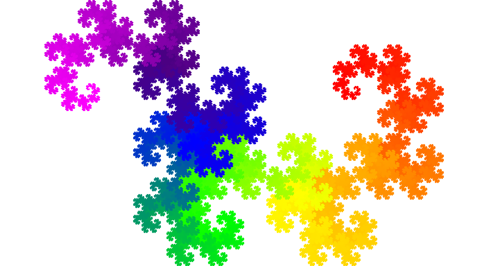
# Dragon Curve
This repository contains two different implementations of a dragon curve, a self-similar fractal. The first implementation was done after only a single year of computer science studies, i.e. after learning the basics of programming. This is why this implemenation is very unoptimised and it made sense to revisit it a couple of years later after completing the studies. Armed with more knowledge and experience, the second implementation was done way faster to no surprise and it also layed the groundwork for a couple of extensions.

  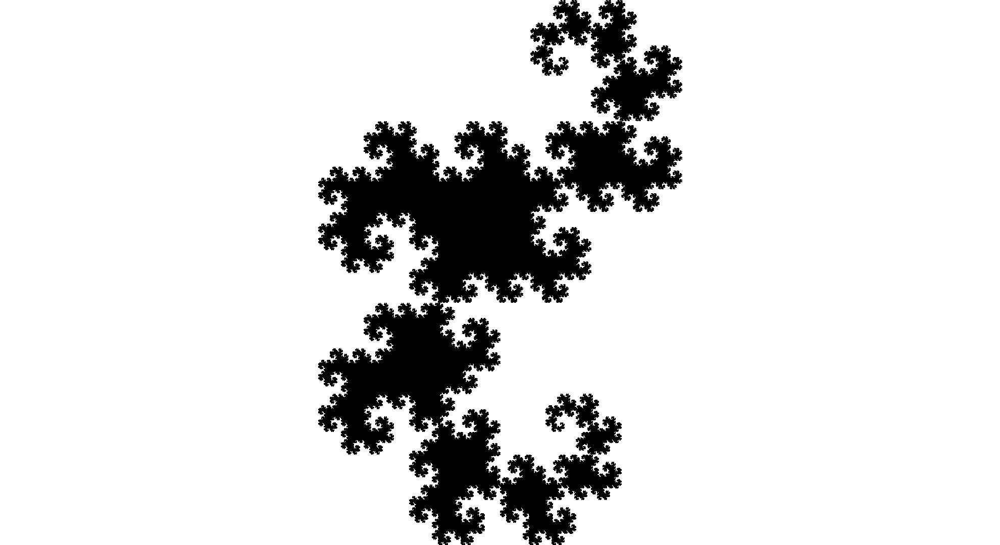
  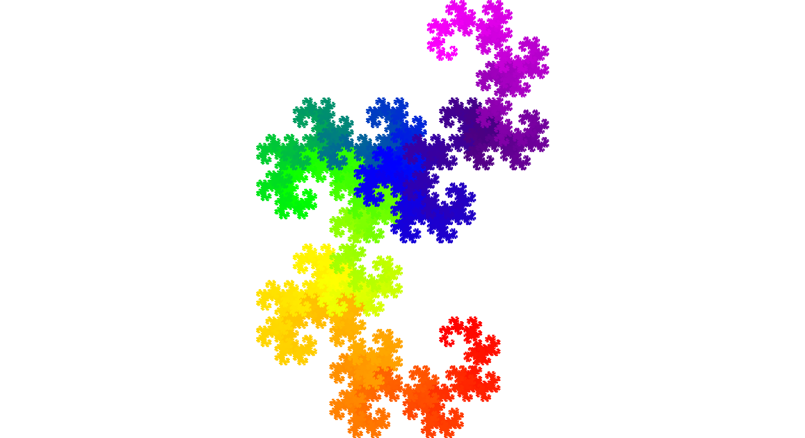 

## First implementation
- `DragonCurve`
- `ColoredDragonCurve`
- `LevyCurve` (Lévy C curve aka Lévy dragon)

The [`DragonCurve.java`](src/DragonCurve.java) file contains the basic implementation of the fractal while the [`ColoredDragonCurve.java`](src/ColoredDragonCurve.java) script extends on it by colouring the curve using a rainbow colour spectrum. Additionally, a simple implementation of a Lévy dragon can be found in [`LevyCurve.java`](src/LevyCurve.java).

  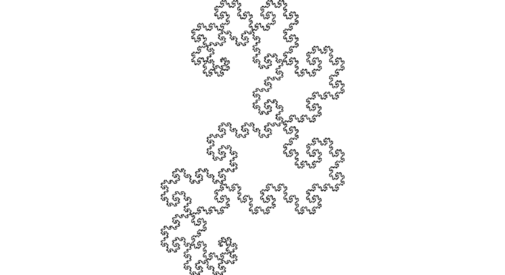
  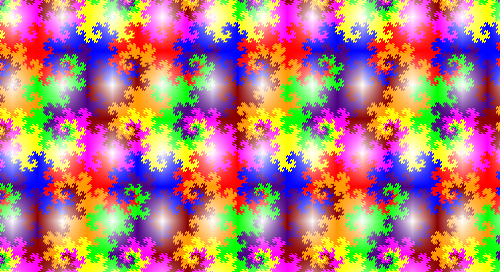 

## Second implementation
- `Main`
- `DragonCurveRevisited`
- `Point`, `Line`, `RainbowColours`

The different implementations, i.e. the standard dragon curve, its coloured variant as well as the tiling and contour version, can be run from the [`Main.java`](src/Main.java) class. The main programming logic to calculate and draw the points for the dragon curve is written in the [`DragonCurveRevisited.java`](src/DragonCurveRevisited.java) class. Finally, [`Point.java`](src/Point.java), [`Line.java`](src/Line.java) and [`RainbowColours.java`](src/RainbowColours.java) are helper classes.

The main improvements over the first implementation are as follows:
- Applying a 90° rotation instead of folding each line in half
- Applying the rotation in parallel to all points
- Splitting up the logic into multiple files
- Scaling the curve to occupy the whole canvas
- Extending the implementation (tiling, contour)

---

## Results

### Execution runtimes

| Fractal     | N = 5       | N = 10 | N = 20 | N = 25 |
| ----------- | :-----------: | :-----------: | :-----------: | :-----------: |
| DragonCurve      | 0.014s| 0.298s | 239.724s | 7351.062s |
| ColoredDragonCurve   | 0.013s | 0.298s | 236.354s | 7251.778s |
| LevyCurve      | 0.001s | 0.005s | 0.339s | 7.516s |
| DragonCurveRevisited (black)     | 0.639s | 0.6s | 1.015s | 10.62s|
| DragonCurveRevisited  (coloured)    | 0.616s | 0.571s | 1.131s | 13.343s |
| DragonCurveRevisited  (tiling)   | 1.948s | 1.116s | 6.051s| 161.297s |
| DragonCurveRevisited  (contour)    | 0.686s | 0.709s | 853.337s |est. >24h|

### Images
<table>
  <caption>Fractals at different stages</caption>
  <tr>
    <td></td>
    <td align=center>N = 5</td>
    <td align=center>N = 10</td>
    <td align=center> N = 20</td>
  </tr>
  <tr>
    <td>
Lévy C curve
</td>
    <td>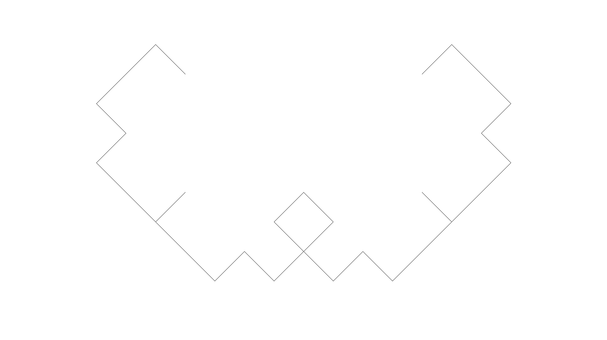</td>
    <td>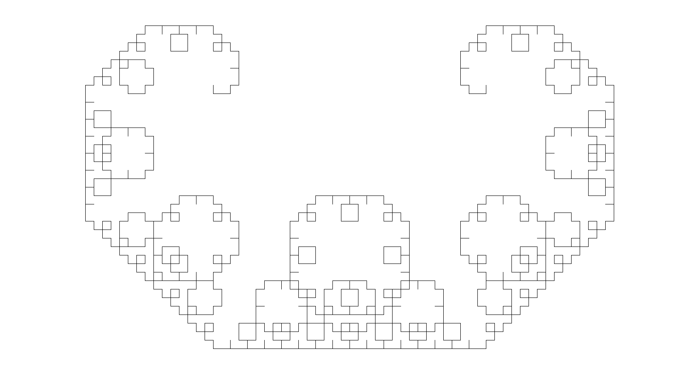</td>
    <td>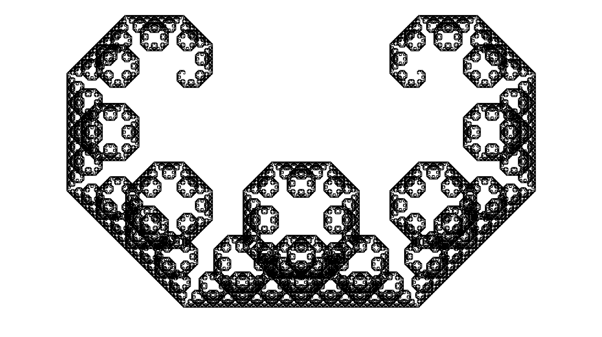</td>
  </tr>
  <tr>
    <td>
Dragon curve
</td>
    <td></td>
    <td></td>
    <td>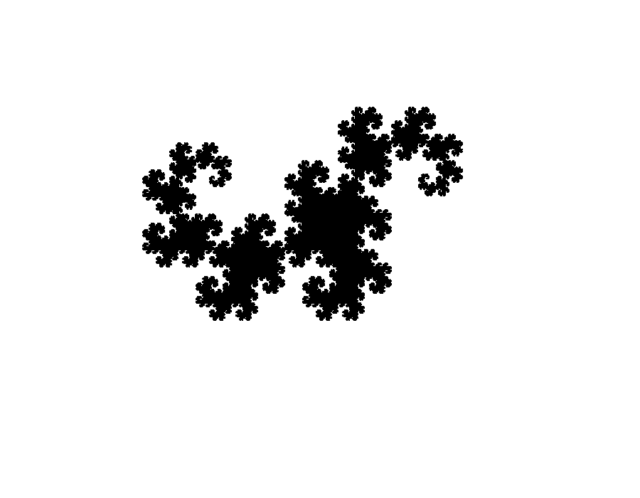</td>
  </tr>
  <tr>
    <td>
Dragon curve (coloured)
</td>
    <td>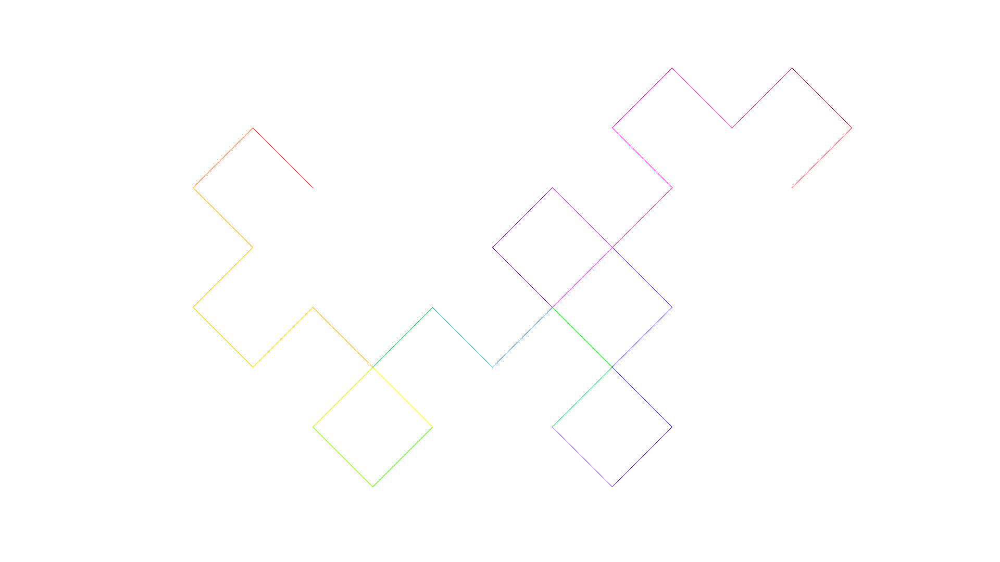</td>
    <td>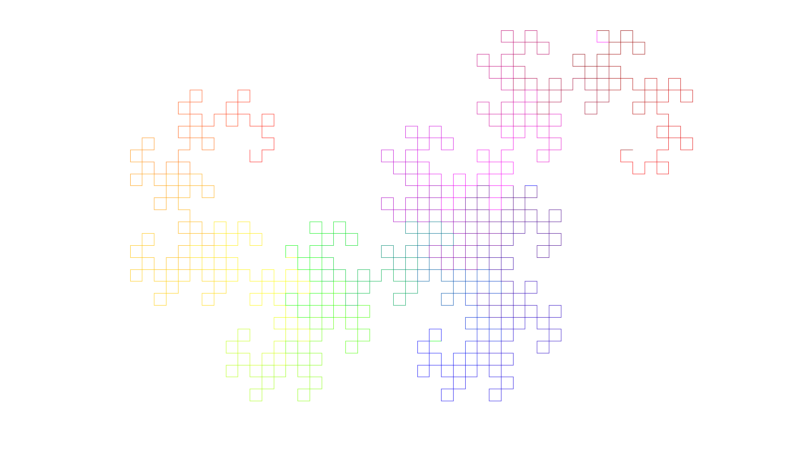</td>
    <td>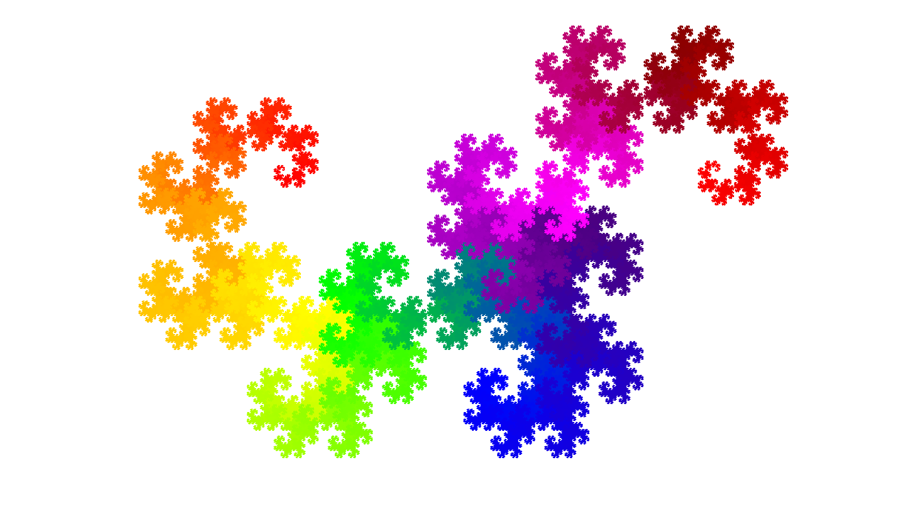</td>
  </tr>
  <tr>
    <td>
Dragon curve (revisited)
</td>
    <td></td>
    <td></td>
    <td></td>
  </tr>
  <tr>
    <td>
Dragon curve (revisited & coloured)
</td>
    <td></td>
    <td>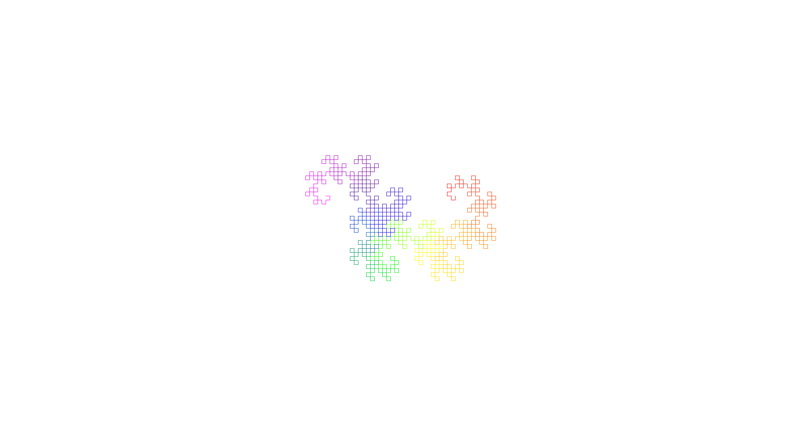</td>
    <td></td>
  </tr>
  <tr>
    <td>
Dragon curve (revisited & tiling)
</td>
    <td>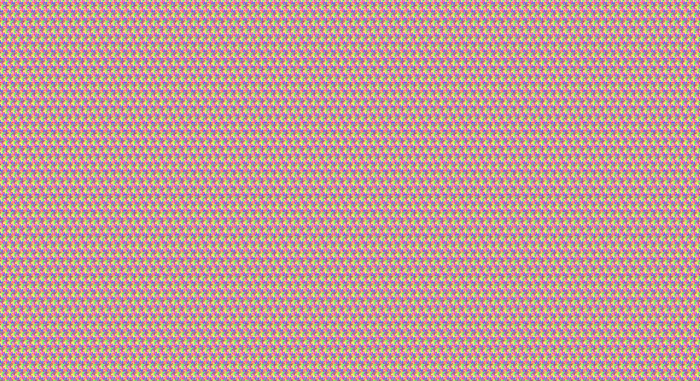</td>
    <td>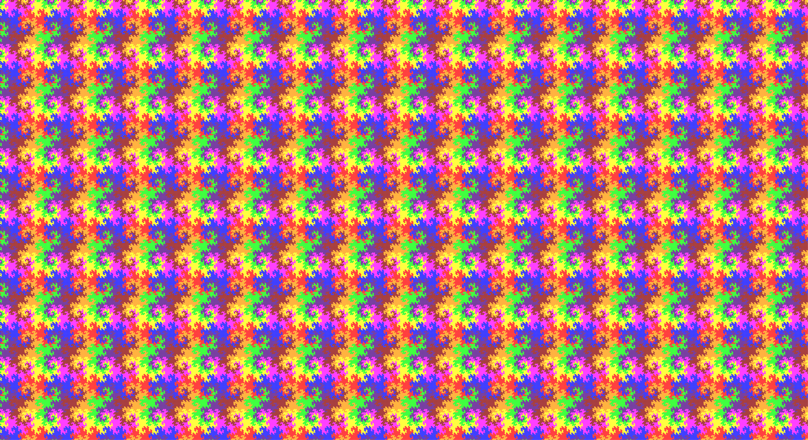</td>
    <td>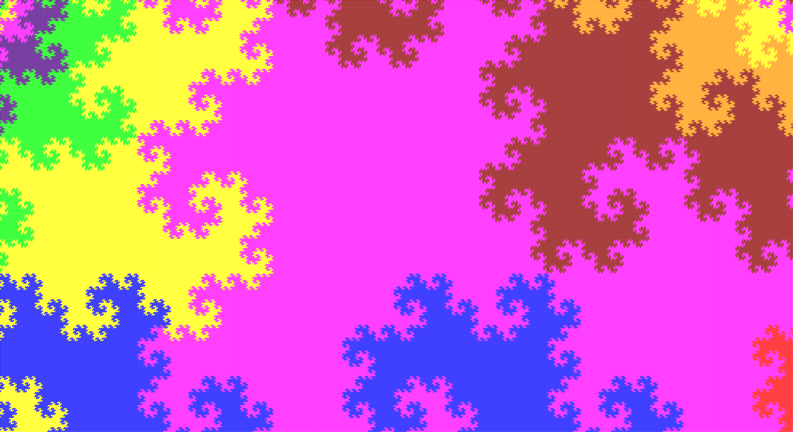</td>
  </tr>
  <tr>
    <td>
Dragon curve (revisited & contour)
</td>
    <td></td>
    <td></td>
    <td></td>
  </tr>
 </table>

Different contour thicknesses

    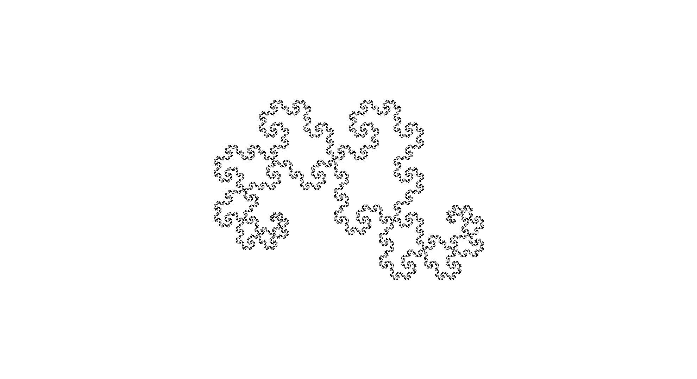
    
    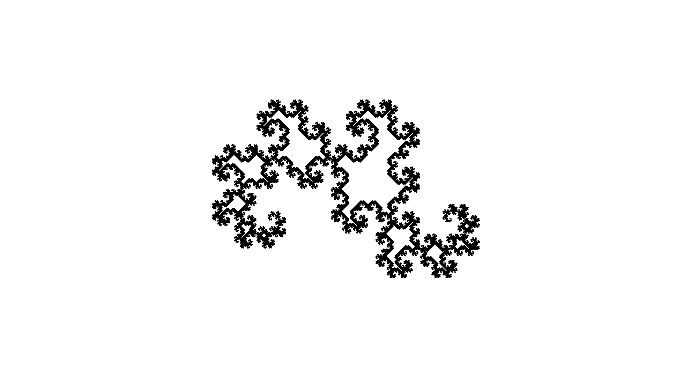

